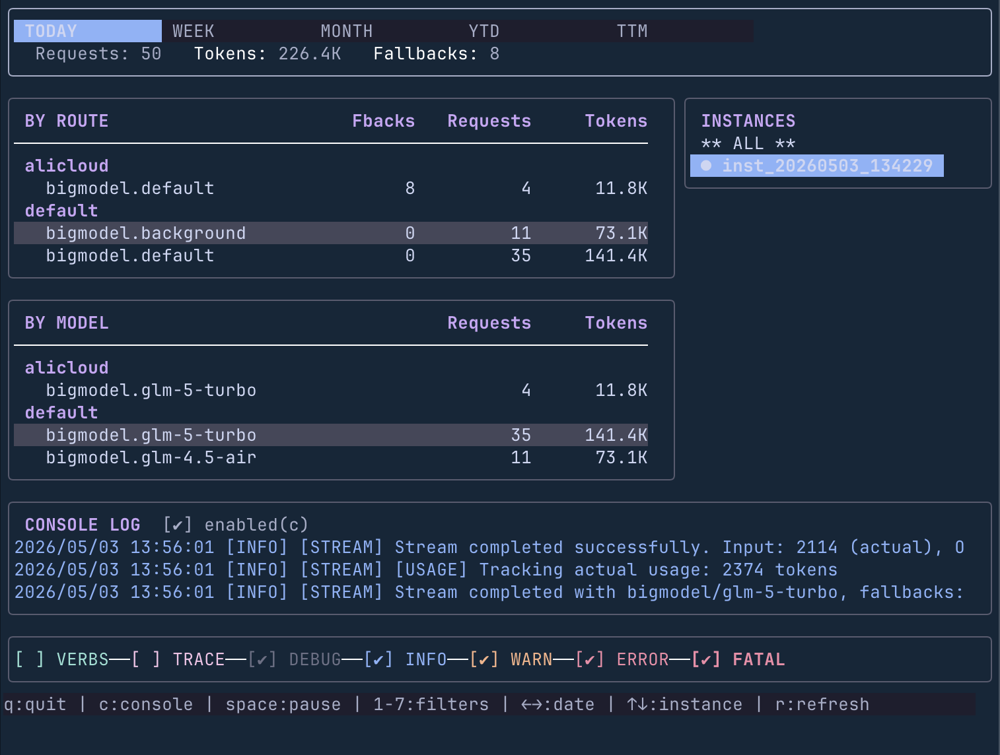

# cc-modelrouter

[](https://go.dev)
[](https://goreportcard.com/report/github.com/iimmutable/cc-modelrouter)
[](https://github.com/iimmutable/cc-modelrouter/actions/workflows/ci.yml)

Code with any frontier LLM from Claude Code — no vendor lock-in, no format headaches.

#ClaudeCode #LLMRouter #MultiProvider #cc #ccrouter #VibeCoding #AgenticCoding

The vibe coding landscape moves fast. Last month's best model might not be this month's. cc-modelrouter gives you a single local proxy that auto-routes Claude Code requests to any provider — GLM, GPT, Claude, Gemini, Kimi, Qwen — handling every API format difference transparently.

```
Claude Code  -->  ccrouter (localhost)  -->  Provider API
                   (auto-routes)              (GLM, GPT, Claude, Gemini, Kimi, Qwen)
```

## Why cc-modelrouter?

- **The best coding model changes weekly.** Last month it was Claude, this month it might be GLM-5.1 or Kimi K2.5. Hardcoding a single provider means reconfiguring every time the landscape shifts. cc-modelrouter routes to any provider through one stable config.
- **Claude Code only speaks Anthropic API.** Every other provider speaks something different — OpenAI format, Gemini native, GLM's Anthropic-compatible dialect. cc-modelrouter handles the translation transparently.
- **Smart routing, not just proxying.** Background agents get cheaper models; deep reasoning gets the heavy hitters. Routes are detected automatically from request characteristics — think level, modality, context size.

Runs locally on localhost. API keys never leave your machine. Admin API is token-authenticated.

## How Is This Different?

| | cc-modelrouter | `ANTHROPIC_BASE_URL` | OpenRouter | LiteLLM |
|---|---|---|---|---|
| **Multi-provider** | Yes | One at a time | Yes | Yes |
| **Per-request routing** | Automatic | No | No | No |
| **Failover** | Sequential, per route | No | No | Config-based |
| **Thinking-level detection** | Built-in | No | No | No |
| **Local monitoring** | Built-in TUI | No | Dashboard only | Web UI |
| **Stack** | Single Go binary | None | SaaS | Python + Redis |

## Quick Start

### Install

```bash
go install github.com/iimmutable/cc-modelrouter/cmd/ccrouter@latest
```

### Configure

The easiest way is the interactive TUI wizard:

```bash
ccrouter config
```


Or create `~/.cc-modelrouter/config.json` manually:

```json
{
  "providers": {
    "bigmodel": {
      "apiKey": "${CCROUTER_BIGMODEL_API_KEY}",
      "baseURL": "https://open.bigmodel.cn/api/anthropic",
      "transformer": "glm_anthropic",
      "models": ["glm-5.1", "glm-4.7"]
    },
    "openrouter": {
      "apiKey": "${CCROUTER_OPENROUTER_API_KEY}",
      "baseURL": "https://openrouter.ai/api",
      "transformer": "anthropic",
      "models": ["anthropic/claude-sonnet-4.6", "openai/gpt-5.4"]
    }
  },
  "router": {
    "routes": {
      "default": "openrouter:anthropic/claude-sonnet-4.6",
      "background": "bigmodel:glm-4.7",
      "think": "openrouter:anthropic/claude-sonnet-4.6",
      "ultrathink": "bigmodel:glm-5.1"
    }
  }
}
```

### Run

```bash
ccrouter code
```

This starts the router and launches Claude Code with the proxy auto-configured.

For standalone mode (use with any Anthropic-compatible client):

```bash
ccrouter start
export ANTHROPIC_BASE_URL=http://localhost:8081
```

See [docs/configuration.md](docs/configuration.md) for the full configuration reference.

> Models are continuously updated — run `ccrouter config` to see the latest.

## Supported Providers & Models

| Provider | Type | Models |
|----------|------|--------|
| **Zhipu GLM** | Direct | glm-5.1, glm-5-turbo, glm-5v-turbo, glm-4.7, glm-4.6v |
| **Anthropic** | Direct | claude-opus-4.6, claude-opus-4.5, claude-sonnet-4.6, claude-haiku-4.5 |
| **OpenRouter** | Aggregator | openai/gpt-5.4, openai/gpt-5.4-mini, openai/gpt-5.3-codex, google/gemini-2.5-flash, google/gemini-2.5-pro, anthropic/claude-opus-4.6, anthropic/claude-sonnet-4.6 |
| **Aliyun DashScope** | Aggregator | MiniMax-M2.5, kimi-k2.5, qwen3-coder-plus, glm-5, glm-4.7 |

OpenRouter provides access to Anthropic, OpenAI, and Google models through a single API key.

## Smart Routing

Routes are detected automatically from request characteristics. Configure which provider:model each route uses.

| Route | Trigger | Example Use |
|-------|---------|-------------|
| `ultrathink` | `budget_tokens >= 32,000` | Deep architectural planning |
| `thinkMore` | `budget_tokens >= 10,000` | Complex refactoring |
| `think` | `budget_tokens >= 4,000` | Standard reasoning tasks |
| `background` | Background agent flag | File indexing, linting |
| `image` | Request contains image blocks | Screenshot analysis, UI review |
| `webSearch` | Tool names contain "web"/"search" | Research-heavy tasks |
| `longContext` | Token count > 60,000 | Large codebase analysis |
| `default` | Fallback | Everything else |

**Thinking level cascade:** If `ultrathink` is not configured, it falls back to `thinkMore`, then `think`.

## Route Profiles

Switch between entire routing configurations without restarting. Perfect for toggling between "standard", "cost-optimized", or "speed-first" strategies on the fly.

**At launch:**
```bash
ccrouter code --profile cost-opt
ccrouter start --profile speed-first
```

**Hot-switch mid-session** using the `/profile` slash command in Claude Code:
```
/profile cost-opt    # switch to cheaper models
/profile standard    # switch back to default
/profile             # list all profiles
```

Profiles are defined in your config:
```json
{
  "router": {
    "profiles": {
      "standard": {
        "name": "Standard",
        "routes": {
          "default": "openrouter:anthropic/claude-sonnet-4.6",
          "ultrathink": "bigmodel:glm-5.1"
        }
      },
      "cost-opt": {
        "name": "Cost Optimized",
        "routes": {
          "default": "bigmodel:glm-4.7",
          "ultrathink": "bigmodel:glm-5.1"
        }
      }
    }
  }
}
```

## Auto-Failover

Never lose a session to a provider outage. Define failover chains per route using semicolon-separated `provider:model` pairs — ccrouter automatically tries the next provider if one fails:

```json
"default": "openrouter:anthropic/claude-sonnet-4.6;bigmodel:glm-5.1;gemini:gemini-2.5-pro"
```

If OpenRouter is down, it seamlessly falls back to GLM, then Gemini. Max attempts = 2× the number of providers in the chain.

## Features

- **Config Wizard** — full-screen interactive TUI for setup (`ccrouter config`)
- **Request Compaction** — automatic request reduction for providers with context window limits
- **Instance Isolation** — each `ccrouter code` gets its own port, PID, and log file
- **Project Config** — per-project config completely overrides global settings
- **Usage Tracking** — SQLite-based token tracking with buffered writes

## Security

- **API keys stay local** — requests are proxied through localhost; keys never leave your machine.
- **Automatic header sanitization** — 11+ sensitive headers redacted case-insensitively (Authorization, X-Api-Key, Cookie, etc.).
- **Environment variable interpolation** — use `${VAR_NAME}` in config to keep secrets out of config files.
- **Verified by tests** — security test suite verifies secrets never appear in log output.

## Live Monitor

Real-time token usage dashboard. Track requests, tokens, and fallbacks by route and model — with live log tailing.



## CLI

| Command | Description |
|---------|-------------|
| `ccrouter code` | Start router + launch Claude Code |
| `ccrouter start` | Start standalone router |
| `ccrouter stop [id]` | Stop instance (all if no ID) |
| `ccrouter status` | Show running instances |
| `ccrouter config` | Interactive config wizard (TUI) |
| `ccrouter monitor` | Live usage monitor (TUI) |
| `ccrouter profile list` | List route profiles |
| `ccrouter profile switch <name>` | Switch profile |

See [docs/cli-reference.md](docs/cli-reference.md) for the full command reference with all flags.

## Development

```bash
# Build
go build -o bin/debug/ccrouter ./cmd/ccrouter
GOOS=linux GOARCH=amd64 go build -o bin/linux-amd64/ccrouter ./cmd/ccrouter

# Test
go test ./...
go test -coverprofile=coverage.out && go tool cover -html=coverage.out
go test -v ./test/security   # security tests
```

### Project Structure

```
cc-modelrouter/
├── cmd/ccrouter/              # CLI entry point
├── internal/
│   ├── cli/                   # Cobra commands
│   ├── config/                # Config loading with env var interpolation
│   ├── configwizard/          # Interactive TUI wizard (Bubble Tea)
│   ├── daemon/                # Instance management (PID files, metadata)
│   ├── interceptor/           # Request/response/streaming interceptors
│   ├── logging/               # Logging with header sanitization
│   ├── monitor/               # Live usage monitor (TUI)
│   ├── provider/              # HTTP clients for provider APIs
│   ├── proxy/                 # HTTP proxy server and request handler
│   ├── router/                # Route detection and sequential failover
│   ├── transformer/           # Format transformers (Anthropic, OpenAI, Gemini, GLM)
│   └── usage/                 # SQLite usage tracking
├── pkg/api/anthropic/         # Anthropic API type definitions
└── docs/                      # Architecture, config, transformers, troubleshooting
```

See [docs/architecture.md](docs/architecture.md) for the full architecture and [docs/transformers.md](docs/transformers.md) for transformer details. See [docs/testing.md](docs/testing.md) for test patterns and [docs/troubleshooting.md](docs/troubleshooting.md) for common issues.

PRs welcome.

## Support

If cc-modelrouter saves you from vendor lock-in, consider buying me a coffee:

| Network | Address |
|---------|---------|
| **Solana (SOL)** | `GjpzLx3aX1MvpMVprdZm2hSyzHTSFJAgjwChT1fM1uKv` |
| **Ethereum (USDC)** | `0x0402e35252476230696dc639f502C14e4c92dfD6` |

## License

[MIT](LICENSE)
